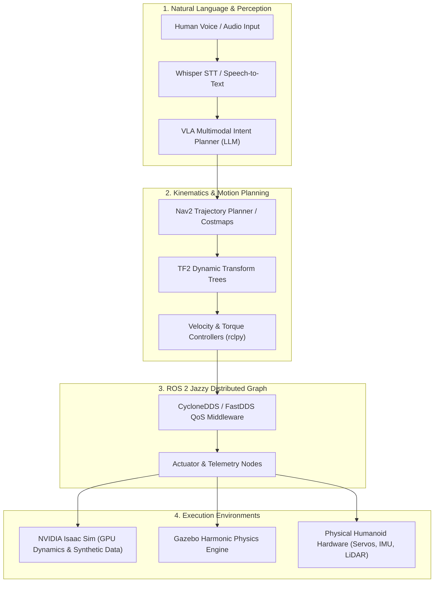

# VECTRA // Physical AI & Humanoid Robotics

> **The definitive engineering blueprint and interactive curriculum for building autonomous humanoid systems — spanning ROS 2 Jazzy distributed networks, GPU physics simulation in Isaac Sim & Gazebo, Nav2 spatial navigation, and Vision-Language-Action (VLA) multimodal agents.**

---

> **Created & Maintained by [Abdullah Qureshi](https://abdullah-qureshi.vercel.app)**  
> 🌐 **Portfolio**: [abdullah-qureshi.vercel.app](https://abdullah-qureshi.vercel.app) • 💼 **LinkedIn**: [abdullahqureshi27](https://www.linkedin.com/in/abdullahqureshi27) • 🐙 **GitHub**: [@abdullahqureshi27](https://github.com/abdullahqureshi27)

---

[](https://docusaurus.io/)
[](https://docs.ros.org/en/jazzy/)
[](https://developer.nvidia.com/isaac-sim)
[](https://nextjs.org/)
[](https://www.typescriptlang.org/)
[](https://github.com/abdullahqureshi27/humanoid-robotics)

---

## 🌟 Key Features

- 🌓 **Adaptive Dual-Theme HUD**: Seamless obsidian dark and high-contrast light modes engineered for long-duration reading and robotics laboratory usage.
- 🤖 **Context-Aware AI Copilot**: Floating assistive widget with real-time RAG retrieval and citation grounding across all 10 curriculum chapters.
- ⚡ **Zero-Emoji Mission-Control Interface**: Clean SVG iconography powered by `lucide-react` paired with telemetry metrics and responsive navigation.
- 📐 **Rigorous Kinematics & URDF Modeling**: Full-body humanoid modeling with mass-inertia tensor matrices, collision hulls, joint limit declarations, and Gazebo plugin integrations.
- 🧠 **Vision-Language-Action (VLA) Pipeline**: End-to-end multimodal agent architecture integrating Whisper voice input, LLM intent planners, Nav2 waypoint generators, and ROS 2 actuator nodes.

---

## 🏗️ Architecture & Data Flow



---

## 🛠️ Technology Stack

| Domain | Technology / Library | Purpose |
|---|---|---|
| **Documentation Engine** | [Docusaurus 3.9](https://docusaurus.io/) | Fast SSG documentation with React 19 and MDX |
| **Robotics Middleware** | [ROS 2 Jazzy](https://docs.ros.org/en/jazzy/) & `rclpy` | Asynchronous pub/sub, service, and action interfaces |
| **Physics Simulation** | [NVIDIA Isaac Sim](https://developer.nvidia.com/isaac-sim) + [Gazebo](https://gazebosim.org/) | Synthetic sensor generation and real-time rigid-body dynamics |
| **Spatial Planning** | [Nav2](https://nav2.org/) + `tf2_ros` | Autonomous pathfinding, costmap buffering, and coordinate transforms |
| **AI Assistant Service** | [Next.js 16](https://nextjs.org/) + [Qdrant](https://qdrant.tech/) | RAG embeddings, vector search, and streaming responses |
| **Languages** | Python 3.10+, C++17, TypeScript 5 | Cross-platform robotics and web engineering |

---

## 📂 Curriculum Tracks (The 4 Pillars)

### Part 1: The Robotic Nervous System (ROS 2 Foundation)
- **Chapter 1: ROS 2 Nodes, Topics, and Services** — Distributed computation graph, pub/sub communication, synchronous request/reply services, and QoS profiles.
- **Chapter 2: Bridging Python Agents to ROS Controllers** — Python package development with `rclpy`, asynchronous callbacks, executors, action servers, and custom message interfaces.
- **Capstone 1**: Multi-node telemetry & closed-loop velocity controller.

### Part 2: The Digital Twin (Physics & Kinematics)
- **Chapter 3: Robot Morphology & Physics in Gazebo** — Precision kinematic modeling with URDF and Xacro, visual meshes, collision bounds, and mass-inertia tensor matrices.
- **Chapter 4: Spatial Awareness & TF2 Coordinate Frames** — Dynamic transformation trees (`tf2`), forward & inverse kinematics, frame buffering, and sensor frame calibration.
- **Chapter 5: Immersive Visualization with Unity HRI** — Real-time sensor streaming over WebSockets/ROS-TCP-Endpoint and interactive digital twin rendering.
- **Capstone 2**: Articulated bipedal humanoid digital twin with simulated joint actuators.

### Part 3: Advanced Simulation & Perception (Isaac Sim & Nav2)
- **Chapter 6: High-Fidelity Physics in NVIDIA Isaac Sim** — GPU physics simulation, PhysX tensor APIs, domain randomization, and photorealistic RTX rendering.
- **Chapter 7: Synthetic Perception & Computer Vision** — Isaac Sim Replicator pipelines, RGB-D sensor streams, and edge-AI camera integrations.
- **Chapter 8: Humanoid Bipedal Locomotion & Nav2** — Footstep planning, dynamic balance stability, costmap configuration, and waypoint navigation.
- **Capstone 3**: Autonomous bipedal navigation across cluttered indoor obstacle courses.

### Part 4: Vision-Language-Action (VLA Intelligence)
- **Chapter 9: The Voice-to-Action Pipeline** — Whisper speech recognition, wake-word detection, and multimodal prompt parsing.
- **Chapter 10: Cognitive Robotics & VLA Autonomous Agents** — Multimodal LLM task decomposers, closed-loop visual feedback, and autonomous error recovery.
- **Grand Capstone**: End-to-end voice-commanded humanoid fetching and manipulation mission.

---

## 🚀 Local Quickstart Guide

### Prerequisites
- Node.js v20+ or v22 LTS
- npm or pnpm
- Git

### 1. Clone Repository
```bash
git clone https://github.com/abdullahqureshi27/humanoid-robotics.git
cd humanoid-robotics
```

### 2. Run Book Frontend (Docusaurus)
```bash
cd book-source
npm install
npm run start -- --port 3005
```
Open [http://localhost:3005/humanoid-robotics/](http://localhost:3005/humanoid-robotics/) in your browser.

### 3. Run AI Copilot Service (Optional)
```bash
cd ../chatbot
npm install
npm run dev
```

---

## 🧪 Testing & Verification

```bash
# In book-source:
npm run typecheck    # Validate TypeScript declarations (0 errors)
npm run build        # Compile production bundle
```

---

## 👨‍💻 Author & Connect

**Abdullah Qureshi**  
*Full-Stack & AI Systems Engineer*

- 🌐 **Portfolio**: [https://abdullah-qureshi.vercel.app](https://abdullah-qureshi.vercel.app)
- 💼 **LinkedIn**: [https://www.linkedin.com/in/abdullahqureshi27](https://www.linkedin.com/in/abdullahqureshi27)
- 🐙 **GitHub**: [https://github.com/abdullahqureshi27](https://github.com/abdullahqureshi27)
- ✉️ **Contact**: [mabdullahqureshi583@gmail.com](mailto:mabdullahqureshi583@gmail.com)
